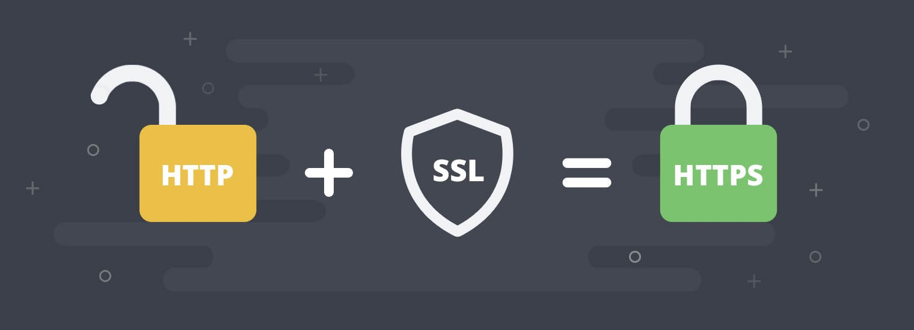

# Spring Framework

## IoC Container（IoCコンテナ）

从图中可以看到，软件中的对象就像齿轮一样，协同工作，但是互相耦合，一个零件不能正常工作，整个系统就崩溃了。这是一个强耦合的系统。齿轮组中齿轮之间的啮合关系,与软件系统中对象之间的耦合关系非常相似。对象之间的耦合关系是无法避免的，也是必要的，这是协同工作的基础。现在，伴随着工业级应用的规模越来越庞大，对象之间的依赖关系也越来越复杂，经常会出现对象之间的多重依赖性关系，因此，架构师和设计师对于系统的分析和设计，将面临更大的挑战。对象之间耦合度过高的系统，必然会出现牵一发而动全身的情形。


为了解决对象间耦合度过高的问题，软件专家Michael Mattson提出了IoC理论，用来实现对象之间的“解耦”。

控制反转（Inversion of Control）是一种是面向对象编程中的一种设计原则，用来减低计算机代码之间的耦合度。其基本思想是：借助于“第三方”实现具有依赖关系的对象之间的解耦。


由于引进了中间位置的“第三方”，也就是IOC容器，使得A、B、C、D这4个对象没有了耦合关系，齿轮之间的传动全部依靠“第三方”了，全部对象的控制权全部上缴给“第三方”IOC容器，所以，IOC容器成了整个系统的关键核心，它起到了一种类似“粘合剂”的作用，把系统中的所有对象粘合在一起发挥作用，如果没有这个“粘合剂”，对象与对象之间会彼此失去联系，这就是有人把IOC容器比喻成“粘合剂”的由来。
我们再来看看，控制反转(IOC)到底为什么要起这么个名字？我们来对比一下：

软件系统在没有引入IOC容器之前，如图1所示，对象A依赖于对象B，那么对象A在初始化或者运行到某一点的时候，自己必须主动去创建对象B或者使用已经创建的对象B。无论是创建还是使用对象B，控制权都在自己手上。

软件系统在引入IOC容器之后，这种情形就完全改变了，如图2所示，由于IOC容器的加入，对象A与对象B之间失去了直接联系，所以，当对象A运行到需要对象B的时候，IOC容器会主动创建一个对象B注入到对象A需要的地方。
通过前后的对比，我们不难看出来：对象A获得依赖对象B的过程,由主动行为变为了被动行为，控制权颠倒过来了，这就是“控制反转”这个名称的由来。

### 依赖注入（Dependency injection）
**依赖注入**就是将实例变量传入到一个对象中去(Dependency injection means giving an object its instance variables)。

**什么是依赖**

如果在 Class A 中，有 Class B 的实例，则称 Class A 对 Class B 有一个依赖。例如下面类 Human 中用到一个 Father 对象，我们就说类 Human 对类 Father 有一个依赖。

```java
public class Human {
    ...
    Father father;
    ...
    public Human() {
        father = new Father();
    }
}
```

仔细看这段代码我们会发现存在一些问题：

1. 如果现在要改变 father 生成方式，如需要用new Father(String name)初始化 father，需要修改 Human 代码；
2. 如果想测试不同 Father 对象对 Human 的影响很困难，因为 father 的初始化被写死在了 Human 的构造函数中；
3. 如果new Father()过程非常缓慢，单测时我们希望用已经初始化好的 father 对象 Mock 掉这个过程也很困难

**依赖注入**

上面将依赖在构造函数中直接初始化是一种 Hard init 方式，弊端在于两个类不够独立，不方便测试。我们还有另外一种 Init 方式，如下：

```java
public class Human {
    ...
    Father father;
    ...
    public Human(Father father) {
        this.father = father;
    }
}
```
上面代码中，我们将 father 对象作为构造函数的一个参数传入。在调用 Human 的构造方法之前外部就已经初始化好了 Father 对象。像这种非自己主动初始化依赖，而通过外部来传入依赖的方式，我们就称为依赖注入。

现在我们发现上面 1 中存在的两个问题都很好解决了，简单的说依赖注入主要有两个好处：

1. 解耦，将依赖之间解耦。
2. 因为已经解耦，所以方便做单元测试，尤其是 Mock 测试。

**控制反转和依赖注入的关系**

我们已经分别解释了控制反转和依赖注入的概念。有些人会把控制反转和依赖注入等同，但实际上它们有着本质上的不同。

- 控制反转是一种思想
- 依赖注入是一种设计模式

IoC框架使用依赖注入作为实现控制反转的方式，但是控制反转还有其他的实现方式，例如说[ServiceLocator](https://martinfowler.com/articles/injection.html)，所以不能将控制反转和依赖注入等同。

**Spring中的依赖注入**

上面我们提到，依赖注入是实现控制反转的一种方式。下面我们结合Spring的IoC容器，简单描述一下这个过程。

```java
class MovieLister...
    private MovieFinder finder;
    public void setFinder(MovieFinder finder) {
        this.finder = finder;
    }

class ColonMovieFinder...
    public void setFilename(String filename) {
        this.filename = filename;
    }
```

我们先定义两个类，可以看到都使用了依赖注入的方式，通过外部传入依赖，而不是自己创建依赖。那么问题来了，谁把依赖传给他们，也就是说谁负责创建finder，并且把finder传给MovieLister。答案是Spring的IoC容器。

要使用IoC容器，首先要进行配置。这里我们使用xml的配置，也可以通过代码注解方式配置。下面是spring.xml的内容

```xml
<beans>
    <bean id="MovieLister" class="spring.MovieLister">
        <property name="finder">
            <ref local="MovieFinder"/>
        </property>
    </bean>
    <bean id="MovieFinder" class="spring.ColonMovieFinder">
        <property name="filename">
            <value>movies1.txt</value>
        </property>
    </bean>
</beans>
```

在Spring中，每个bean代表一个对象的实例，默认是单例模式，即在程序的生命周期内，所有的对象都只有一个实例，进行重复使用。通过配置bean，IoC容器在启动的时候会根据配置生成bean实例。具体的配置语法参考Spring文档。这里只要知道IoC容器会根据配置创建MovieFinder，在运行的时候把MovieFinder赋值给MovieLister的finder属性，完成依赖注入的过程。

```java
public void testWithSpring() throws Exception {
    ApplicationContext ctx = new FileSystemXmlApplicationContext("spring.xml");//1
    MovieLister lister = (MovieLister) ctx.getBean("MovieLister");//2
    Movie[] movies = lister.moviesDirectedBy("Sergio Leone");
    assertEquals("Once Upon a Time in the West", movies[0].getTitle());
}
```

1. 根据配置生成ApplicationContext，即IoC容器。
2. 从容器中获取MovieLister的实例。

### 总结

1. 控制反转是一种在软件工程中解耦合的思想，调用类只依赖接口，而不依赖具体的实现类，减少了耦合。控制权交给了容器，在运行的时候才由容器决定将具体的实现动态的“注入”到调用类的对象中。

2. 依赖注入是一种设计模式，可以作为控制反转的一种实现方式。依赖注入就是将实例变量传入到一个对象中去(Dependency injection means giving an object its instance variables)。

3. 通过IoC框架，类A依赖类B的强耦合关系可以在运行时通过容器建立，也就是说把创建B实例的工作移交给容器，类A只管使用就可以。

# 网络
## HTTP/HTTPS协议
### 定义

**HTTP(超文本传输协议，Hypertext Transfer Protocal**是一种用于从网络传输超文本到本地浏览器的传输协议。它定义了客户端与服务器之间请求和相应的格式。HTTP工作在TCP/IP模型之上，通常使用端口```80```

**HTTPS(超文本传输安全协议，Hypertext Transfer Protocol Secure**是HTTP的安全版本，它在HTTP下增加了SSL/TLS协议，提供了数据加密，完整性校验和身份验证。HTTPS通常使用端口```443```



### 工作原理
#### HTTP协议
HTTP协议工作与客户端-服务端（C/S）架构上


HTTP工作过程如下：
1. **客户端发起请求**：用户通过客户端（如浏览器）输入URL，客户端向服务器发起一个HTTP请求。
2. **服务器处理请求**：服务器接收到请求后，根据请求的类型（如GET，POST）和请求的资源，进行相应的处理。
3. **服务器返回相应**：服务器将处理结果包装成HTTP响应消息，发送回客户端。
4. **客户端渲染页面**：客户端接收到响应后，根据响应内容（如HTML，图片等）渲染页面，展示给用户。
5. **服务器关闭TCP连接**：一般情况下，一旦Web服务器向浏览器发送数据之后，就要关闭TCP连接了。

HTTP三点注意事项：
1. HTTP 是无连接：无连接的含义是限制每次连接只处理一个请求，服务器处理完客户的请求，并收到客户的应答后，即断开连接，采用这种方式可以节省传输时间。
2. HTTP 是媒体独立的：这意味着，只要客户端和服务器知道如何处理的数据内容，任何类型的数据都可以通过HTTP发送，客户端以及服务器指定使用适合的 MIME-type 内容类型。
3. HTTP 是无状态：HTTP 协议是无状态协议，无状态是指协议对于事务处理没有记忆能力，缺少状态意味着如果后续处理需要前面的信息，则它必须重传，这样可能导致每次连接传送的数据量增大，另一方面，在服务器不需要先前信息时它的应答就较快。

#### HTTPS协议
HTTPS协议是在客户端与服务器之间建立了一个安全层。在使用HTTP协议建立通信的时候，必须先进过一个安全层，对数据包进行加密，然后将加密后的数据包传送给服务器，必须将数据包解密，才能将信息传送回客户端。


**证书验证阶段**

浏览器发起 HTTPS 请求
服务端返回 HTTPS 证书
客户端验证证书是否合法，如果不合法则提示告警

**数据传输阶段**

1. 当证书验证合法后，在本地生成随机数

2. 通过公钥加密随机数，并把加密后的随机数传输到服务端

3. 服务端通过私钥对随机数进行解密

4. 服务端通过客户端传入的随机数构造对称加密算法，对返回结果内容进行加密后传输

### HTTP协议的8种请求类型
- **OPTION**：返回服务器针对特定资源所支持的HTTP请求方法。也可以利用向Web服务器发送'*'的请求来测试服务器的功能性。
- **HEAD**：向服务器索要与GET请求相一致的响应，只不过响应体将不会被返回。这一方法可以在不必传输整个响应内容的情况下，就可以获取包含在响应消息头中的元信息。
- **GET**：向特定的资源发出请求。
- **POST**：向指定资源提交数据进行处理请求（例如提交表单或者上传文件）。数据被包含在请求体中。POST请求可能会导致新的资源的创建和/或已有资源的修改。
- **PUT**：向指定资源位置上传其最新内容。
- **DELETE**：请求服务器删除 Request-URI 所标识的资源。
- **TRACE**：回显服务器收到的请求，主要用于测试或诊断。
- **CONNECT**：HTTP/1.1 协议中预留给能够将连接改为管道方式的代理服务器。
  
虽然 HTTP 的请求方式有 8 种，但是我们在实际应用中常用的也就是 get 和 post，其他请求方式也都可以通过这两种方式间接的来实现。

### GET和POST的区别

|          | **GET**                                                  | **POST**                                                         |
| -------- | ---------------------------------------------------- | ------------------------------------------------------------ |
| 概念   | 用于**请求**数据，适用于请求页面、图像或特定资源。 | 常用于向服务器**发送**数据。常用于表单提交、文件上传等。 |
| 编码方式 | GET通过URL传递数据，**数据大小受限于URL长度限制**。 | POST将数据包含在HTTP请求的主体中，适合**传输大量数据**。 |
| 安全性 | GET请求的数据在URL中**可见**，易于被存储和记录。 | POST相对于GET更为安全，因为数据**不会在URL中显示**，较难被拦截。 |
| 性能   | **快**。可以被缓存                                | **慢**。POST请求无法缓存。                              |

### HTTP响应状态码

HTTP 响应状态码用来表明特定 HTTP 请求是否成功完成。具体各编码可以在[这里](https://developer.mozilla.org/zh-CN/docs/Web/HTTP/Status)查看
1. 信息响应 (100–199)
2. 成功响应 (200–299)
3. 重定向消息 (300–399)
4. 客户端错误响应 (400–499)
5. 服务端错误响应 (500–599)
