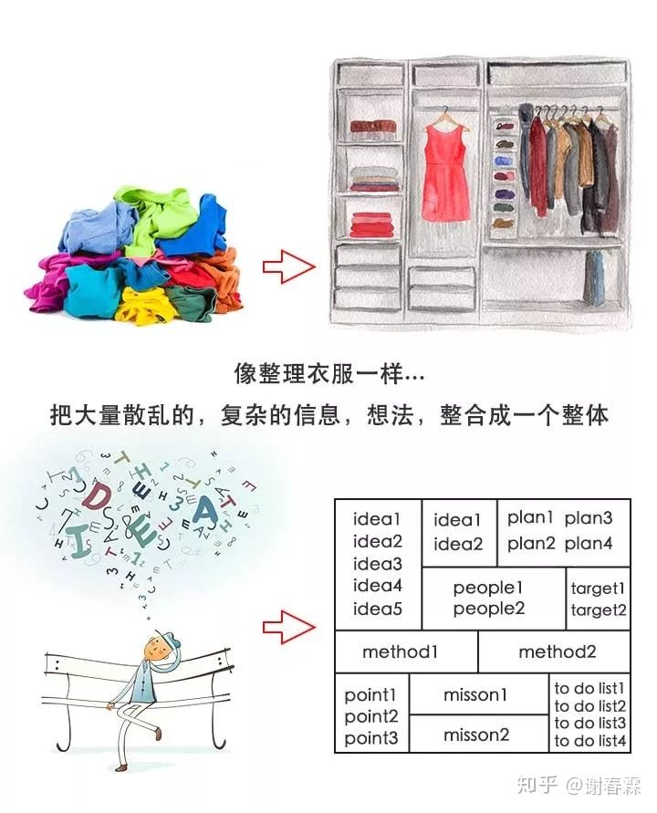

# 思想日记本

## 1. 奇迹
> 一天，彼得对耶稣说：“主啊，我们有个问题。明天我们必须缴纳税款，但是我们根本没有钱。”耶稣回答：“没有问题。”彼得有点糊涂了：“主啊，你还没听懂，我说的是，明天我们必须缴纳税款，但是我们根本没有钱。这就是一个问题。”耶稣再次回答说：“没有问题。”耶稣吩咐彼得去捕鱼。因为彼得以前是个预付，所以这个想法并非是不合理的。比地捕捉到的第一条与的嘴里衔着一枚钱币，这枚钱币付清了税款。
> --选自《财富自由之路》奇迹发生的5个层次之上
- 第一层次：奇迹之所以发生，是因为我们为此付出了努力。
- 第二层次：**去做一些能提升自己技能的事情**
- 第三层次：成为一个人物，一个因为自身能力强大，所以别人主动来接近你的人物。人们遇到苦难马上去找耶稣，是因为人们认为“耶稣肯定有办法”
- 第四层次：税款不是问题。政府不是为了榨取你的钱财而存在的。
- 第五层次：身份，一个“没有问题的人“。

> 一位种植竹子的庄园主将竹子幼苗忠进土里并用土盖住。竹子幼苗要在土里沉睡4年之久。每天清晨，庄园主都来浇灌他们。在第四年年末的时候，沉睡的竹子终于破土而出，之后竹子便在90天之内就长到了大约20米高。在这4年的时间里庄园主根本不确定竹子是否还活着。但是他有信息，而且不离不弃。一位目光远大的思想家也需要这样的信念。
> --选自《财富自由之路》要创造奇迹，你需要勇气

大多数人都高估了自己1年内能做到的事情，也低估了自己10年内能做到的事情。要施加巨大的影响力，就需要所有5个层次都发生深刻的改变。这需要时间。这样的成长可能不会立竿见影，但之后某个时刻会突然爆发出来。

## 2. 结构化思维--解决思维混乱
> 明明心里有很多想法，但就是讲不清楚，是因为表达能力差吗？不是，是因为思维没有结构

我们的大脑处理信息有2个规律：
**1. 太多的信息记不住**
**2. 喜欢有规律的信息**
我们在思考问题的时候，脑子里的想法会不断地涌现出来，看似很多，却杂乱无章，就像是衣柜里一堆没有整理的衣服，彼此缠绕，互相叠在一起。

### 学会结构化思维有什么好处
如果你能够习惯用结构化的方式进行思考，你的思维能力，沟通能力，学习能力都将获得大幅度的提升：

比如，公司的线下门店，生意突然下滑，怎么办？

如果你不会结构化思维，你可能会这样说...
思路清晰，考虑周全。

再比如，你们公司近期要举办一场大型的相亲活动，你是项目的负责人，目前正在召开项目工作会议，老板请你介绍一下本次活动目前的安排：

如果你不会结构化思维，你可能会这样表达...

怎么样？是不是感觉很不一样呢？

好，说了那么多结构化思维的好处，那么，我们应该如何才能拥有这种能力呢？

接下来，我就带你从最基本的地方开始说起，帮助你快速学会结构化思维。

### 快速学会结构化思维
有一天，你驾驶着自己的汽车，在路上游荡，汽车突然停下，发生哄哄的巨响，无法行驶，怎么办？

是哪里出了问题？轮胎？轴承？发动机？油箱？还是有只猫在车里作怪？

一辆汽车，拥有上万个零件，当你发现汽车的行驶功能出现故障时，如果你不是专业修汽车的，你根本不知道是哪个零件可能出了问题，你能想到的也是这上万零件里的一小部分...

你一通乱试后，最终无果，只得叫来拖车，将汽车送入了修理厂...

师傅一看，说：小问题，你稍等片刻…

然后咔咔咔，不到一局王者荣耀的时间，就把车给修好了！

为什么能那么快？

不是有上万个零件吗？

如果逐个检查一遍，至少也需要一天的时间啊，这还不算更换和维修的时间！

师傅为什么能那么快？

因为：结构！

在维修师傅的眼中，汽车并不是由上万个零件拼接而成的，而是「结构化」的：

- 有了结构，师傅就能由局部到整体，快速判断可能导致问题的所有区域。
- 有了结构，师傅就能由混乱到有序，以模块为单位进行整块整组的排查。
- 有了结构，师傅就能由复杂到简单，将大问题切成多个小问题逐个击破。

透过结构看世界，你就拥有了化繁为简的能力！
结构化思维，关键就在于「结构」二字，如果你能找到复杂问题背后的结构，就能像修车师傅那样，将问题化繁为简，变成若干个小问题，从而更快速的找到解决方案。

那么，我们该如何将一个问题结构化呢？

#### 第一步：明确目的，找到分解角度
我们在问题分解之前，得先弄清楚分解的目的是什么，然后根据目的进行拆解与结构化。比如说，对于一个项目：

- 如果目标是分析进度：那就按时间进度，过程阶段来分解；
- 如果目标是分析成本：那就按工作项来分解；
- 如果目标是分析客户：那就按性别、年龄、学历、职业、收入等来分解。

#### 第二步：按MECE原则，组成结构
确定了分解目的，然后我们就要开始搭建结构了，先说一种最基本的结构形态：金字塔结构。

什么是金字塔结构？

简单来说就是：先确认目标问题，再根据分解的目的，将问题分解成不同的类别，类别下再放入对应的不同要素，这样逐层分解，最终的形成类似于金字塔的形状结构。

并且，金字塔的每一层，都必须牢固，不能少一块砖，也不能多一块砖，不然整个结构就会垮塌，这个就称为MECE原则。

什么是MECE原则？

MECE是麦肯锡著名咨询师「巴巴拉·明托」在她的著作《金字塔原理》中提出的核心概念，意思是：相互独立、完全穷尽。

也就是金字塔的每一层，内容不能有重复的部分，也不能有遗漏的部分。

比如，你把衣服分类为：
- 春秋季服饰
- 职业套装

这个就有重叠的部分：有些衣服既是职业装，也是春秋季服饰；

也有遗漏的部分：夏天穿的休闲服应该归到哪一类？

那么，什么才是不重叠，不遗漏，符合MECE原则的呢？
你可以按季节分：春秋装，冬装，夏装。

除了这3类之外，没有其他季节了，这个就是「不遗漏」；春秋的衣服差不多，所以归为一类，夏天的衣服，春秋冬穿不了；冬天的衣服，也不能归类在春夏秋这三个季节里，因此「不重叠」，符合MECE原则。